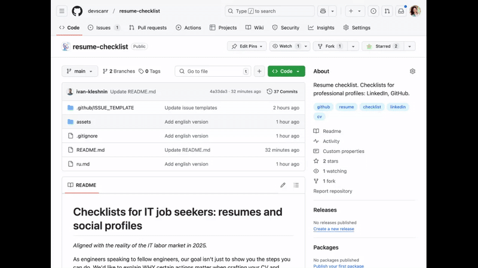

<p align="center">
  <b>English</b>&nbsp;&nbsp;&nbsp;&nbsp;<a href="ru.md">Русский</a>
</p>

# Resume/profile checklists for IT specialists

Below, you'll find a guidance on how to structure your resume(s) and optimize your profiles on career/professional networks such as LinkedIn and GitHub.
Immediate note: terms **Resume** and **CV** are interchangeable, but culturally specific. Use the one that is used and expected in your target area.
By following these simple steps, your resume(s) and profiles will make a stronger impression on recruiters and hiring managers. 

As engineers speaking to fellow engineers, our goal isn't just to show you the steps you can do. We'd like to explain which and why certain actions matter when crafting your resume and preparing for a job search.

To put this insights into practice, fork this repository, enable issues and create a TODO task with a predefined list of actions:



The provided information should be taken as a starting point. There're definitely many more culturally-specific, domain-specific, etc-specific points that were omitted for clarity. If you're interested in further recommendations or a professional resume review – feel free to [ask the authors](mailto:info@devscanr.com). Most pro-tips are contextual and wouldn't fit a general document.  

## List of Content

1. [General checklist](#1-general-checklist-)
2. [Resume checklist](#2-resume-checklist-)
3. [Resume under a microscope](#3-resume-under-a-microscope-)
4. [LinkedIn profile checklist](#4-linkedin-profile-checklist-)
5. [GitHub profile checklist](#5-github-profile-checklist-)
6. [Tools](#6-tools-)
7. [Vocabulary](#7-vocabulary-)

---

## 1. General checklist ✔

General recommendations for resumes and professional network profiles.

It's critical to understand the role of ATS in the job search.
If you never heard about "ATS", read this [short note](#7-vocabulary-)

### 1️⃣ Contact Information

Ensure all contacts (links, usernames, etc) are listed accurately. Verify that links are
functional and up-to-date. Recheck that your location is present and clear.

### 2️⃣ Avatar / Photo

A large topic on its own. [A photo in resume](https://resume.io/blog/picture-on-resume-or-not)
might be legally required, prohibited, or none. Some companies might add more rules... it has to be researched.

Talking about GitHub profiles – a photo works better than a creative avatar. It definitely looks more trustworthy
to see a real face with a real name.

Criteria for a good photo:

- Face-focused portrait. The percentage of "creativity" should be aligned to your role.
- Neutral background and attire.
- Adequate quality: clear, well-exposed image.

How to take a quality photo at home:

- [Video Tutorial](https://www.youtube.com/watch?v=n_rPTWXn__U)
- [Article](https://headshots-inc.com/blog/how-to-take-professional-headshots-at-home/)
- AI photo Enhancer: [ReMini.ai](https://remini.ai) (one photo enhancement for free)
- Paid AI Enhancers: [HeadShotPro](https://www.headshotpro.com/) & [HeadPix.ai](https://headpix.ai/)

For best results, consider a professional photo shoot.

One photo can be reused across various platforms. Opt for light, office-like, or urban backgrounds.
Avoid scenic backdrops like waterfalls, as they might *subconsciously* irritate viewers who haven’t had a vacation in years!

### 3️⃣ Full Name

Synchronize how your name appears across LinkedIn, GitHub, and your resume. Recruiters shouldn't
have to guess if different accounts belong to the same person, especially if you've changed your
surname. For applicants with foreign (non-english) names: transliteration between profiles should remain consistent.

### 4️⃣ Title / Specialty / Desired Position

The title (e.g., Product Engineer) on your resume and profiles must align
with the **position you're applying for**.
This field is crucial for talent searches and filtering within [ATS systems](#7-vocabulary-).

A common mistake is spending mere minutes on crafting a title, assuming it's self-evident. However,
this field deserves careful consideration. Your title should reflect your desired rather than
current role/specialization. Use popular, widely recognized job titles. Phrases like "Backend Ninja" may
make sense to humans but will negatively impact search rankings because text-based searches
prioritize exact matches. As a result, your resume could go unnoticed.

When working on title, we recommend using a [SEO](#7-vocabulary-) approach. Search engine guidelines
for a title typically recommend staying within 50–80 characters. The beginning of the line carries the most weight. 
Keep in mind that you don't know where your title might get truncated or shortened in an ATS, so ensure it looks good 
at varying lengths. We suggest choosing one of these formats:

```
1) [Desired Position Title] | [Narrowing Hard Skill(s)]

EXAMPLES:
Senior Frontend Developer | React.js, Redux, Node.js, Tailwind CSS
Senior Frontend Developer | CSS Animation & Accessibility
```

```
2) [Desired Position Title] | [Value Proposition]

EXAMPLES:
Senior Frontend Developer | Mentoring Teams While Driving Innovation
Senior Frontend Developer | Delivering Pixel-Perfect, Responsive Solutions
```

## 2. Resume checklist ✔

### 1️⃣ Contact information. Full name. Photo.

Follow the guides from the [General checklist](#1-general-checklist-) section.
Professional networks like LinkedIn and GitHub are acceptable (and desired).
Links to your social network profiles are not allowed (and, in some cases, strictly forbidden).

### 2️⃣ Readability

The resume should be easily readable by a human and parsable by a robot.
Use only PDF format (unless the job requirements specify otherwise).
HTML and other formats will be a problem for ATS. Use a standard font of an adequate size (more below). The resume should look clean and readable.

### 3️⃣ Structure

The resume has a standard structure from which it is better not to deviate:

- Headline, the desired position
- Photo (not always, see above)
- Full name
- Current location: country/city
- Contacts. Links to profiles in professional networks (GitHub, GitLab, StackOverflow) – desirable
- Brief description / summary
- Technical stack, up to 7 main technologies
- Work experience
- Work permits – situational
- Readiness for relocation – situational
- Knowledge of languages ​​– situational
- Education

It is not recommended to exceed 1-2 pages for juniors and 2-3 pages for senior specialists. If it
does not fit, try reducing the font size, for example, to 10-12 points. If it still does not fit, you need to cut
out the excess.

_Corrections for students._
Instead of `Work experience → Education`, change the structure to `Education → Projects`.
For non-students, a list of projects is also acceptable, in certain cases.

### 4️⃣ Portfolio / GitHub link

In our view, each engineering resumes should contain a link to your portfolio and/or your GitHub (GitLab) professional account.
NDA is not an argument, there're multiple ways to get around it (legally). If you have nothing to show: no screenshots, no contributions, 
no public projects, no stars, nothing... – it's super bad and must be fixed.

### 5️⃣ Other

It is worth checking the resume with a PDF validator. The text should be proofread several times,
it should not contain spelling errors. Knowledge of the language may be secondary... but errors
indicate problems with attention to detail, a valuable skill. Ask a colleague or friend to check
your resume — this is always useful. Use spell check services.

*Found a typo in this article? Let us know
via [issues](https://github.com/devscanr/resume-checklist/issues)*.

## Common Mistakes

Broadly speaking, as each point might have an exception:

⚠️ Your age, marital status, etc. are indicated<br/>
⚠️ Emojis or other images are used<br/>
⚠️ Non-PDF format like WORD or HTML format is used<br/>
⚠️ External links named "Find out more"<br/>
⚠️ Copy protection is enabled in PDF (may interfere with ATS)<br/>
⚠️ No headings, unfamiliar layour or section names<br/>
⚠️ Politics, religion, unrelated hobbies<br/>
⚠️ Too much or too little information

List your hobbies and interests in LinkedIn, GitHub. There should be no room for this in a resume.
Do not list your soft skills separately – it doesn't look good and trustworthy. Embed them in the **Summary** and/or in the **Work Experience** sections.

## 3. Resume under a microscope 🔬

### 1️⃣ Summary / About me

A short, concise description of your experience, key skills, and achievements.
It presents you as a specialist. Explains why extactly you should be hired.
Maximum 3-4 sentences. For everything else, there are sections "Responsibilities" and "Achievements"
at each place of work. You can write in the 3rd person (adds neutrality)
or in the 1st person (adds individuality). This point may be regulated by law or company rules, double-check.
On LinkedIn, it is better to write in the 1st person.

What can/should be indicated:

- Your general expertise, transferable skills
- Your strengths
- Skills in demand for the desired position
- Your preferences regarding the industry, company, team, project (of course, not all at once)

[Examples for reference](https://resume.supply/examples/software-engineer-objectives-summaries).
The text from the summary is used for cover letters (with modifications).

### 2️⃣ Work experience

Indicate the names of companies, dates of work and positions. Up to the last three that are relevant
to your desired job. Descriptions should be adequate to the position you are applying for and the level of expertise.
Stick to the format `developed > details > effect`. Focus on results and achievements, not the
process. The numbers should match your scope of responsibilities. Junior developers writing about "increased business income by..." raise a lot of questions. 

In the description of tasks and achievements, use active voice and past tense (increased, created,
implemented). The years and months of work should be indicated. Specify the skills that were used in this
position. For the last place, you can even indicate a contact person for communication (maximizing trust).

### 3️⃣ Education

List the primary educational institutions and courses that are directly
relevant to the desired position. Keep only those entries that align with your target role
(students may include relevant projects). Limit to three points.
Format should visually resemble the _Work Experience_ section.
You can mention ongoing education with a corresponding note.

### 4️⃣ Skills

Include only skills that directly match the desired position. Interesting hobbies unrelated to the
field can detract from the resume rather than enhance it. Remember, the resume is a formal document
showcasing your professional capabilities. Focus on listing your core technical stack. Extensive
lists of every framework and library appear unprofessional and do not benefit even a junior-level
candidate.

### 5️⃣ Font

Select a standard font (Arial, Georgia, etc), to ensure your resume is displayed properly in all ATS. 
Recheck that the font size falls within an acceptable range of 10-16px. Use a single font, unless you know what you're doing.

## 6️⃣ How many resumes to create

Short answer: one master resume plus per-role variations.

## 4. LinkedIn profile checklist ✔
 
### 1️⃣ Contact information. Full name. Photo

Follow the recommendations from the [General checklist](#1-general-checklist-) section.

### 2️⃣ Title, desired position

Follow the recommendations from the [General checklist](#1-general-checklist-) section.

LinkedIn has a special block
for listing "Job Titles" options, which can be opened by the blue "Open To" button in the page
header.

We would like to emphasize once again that for recruiters, when they are looking for talent,
your job title is the most important information.
It is recommended to list all common synonyms for the roles by which you would like to be found.
For example: Security Researcher and Malware Analyst can solve identical tasks, but the search will
indicate only one of them.

### 3️⃣ About yourself (main text), Skills

Follow the recommendations from the [Resume under a microscope](#3-resume-under-a-microscope-) section.

A LinkedIn description can be longer and more personalized than a resume. The latter is a dry
description
of you as an employee, as a specialist. Your social profiles, however, can (and should)
add a note of personality and character.

When choosing profile skills and skills related to experience at a specific company, make sure that
the most important skills are listed first. LinkedIn collapses information and can give a false
impression of your competencies if they are not sorted correctly.
In addition, the first skills will naturally collect more reactions (endorsements) than the last.

### 4️⃣ Work experience, Education

Follow the recommendations from the section [Resume under a microscope](#3-resume-under-a-microscope-).

### 5️⃣ Custom URL

Activate a custom URL with your name: `linkedin.com/in/yourname`. Looks more professional.

### 6️⃣ Recommendations

In today's competitive talent market, profiles without reviews look increasingly pale.
There is nothing difficult in exchanging reviews
with former colleagues. Accordingly, their absence means that you 1) do not get along with
colleagues,
or 2) do not show initiative, or 3) think that "this will do".
Would you personally hire a person with such characteristics?

### 7️⃣ "Open to work" flag

Turn on the "Open to work" status. This is a flag that will add your profile to the lists for
recruiters.
Some recruiters have mixed feelings about the green "Open to Work" sign.
The opinion, which we personally do not share, is that this sign is added "out of desperation".

### 8️⃣ Other achievements

Certificates, awards, courses, publications increase trust and indicate "above average" expertise.
All other things being equal, an employer will always prefer a person
with such evidence of competence to another candidate. In addition, all these achievements speak
of you as a "Continuous Learning" expert, and this skill is consistently included in the TOP-5 most
in-demand cross-job skills.

## 5. GitHub profile checklist ✔

### 1️⃣ Contact information. Full name. Avatar

Follow the recommendations in the [General checklist](#1-general-checklist-) section.

### 2️⃣ Brief description (bio)

Follow the recommendations in the [Resume under a microscope](#3-resume-under-a-microscope-) section. 

This field can hold an even shorter summary of your resume or outline your professional goals. 
Since the profile isn’t as formal as a resume/CV, there aren’t strict guidelines here. Still, 
we advise including your title for added clarity.

### 3️⃣ Repositories

Select and pin 3 key repositories at the top of the page. If everything is weak, it is better not to
pin anything.
Add a description to each valuable repository (what kind of project, why it was created, tags).
Do not be among those who did everything that was necessary, but could not or did not want to
present their work.

### 4️⃣ Stars

Set stars to your favorite/interesting technologies, if you haven't already. For active accounts,
the lack of stars suggests that you 1) aren't interested in anything, or 2) don't appreciate other
people's work,
or 3) are super busy and bogged down in business. If you have a lot of stars, organize them into
lists (optional).

### 5️⃣ Followees

Follow leaders in your areas of interest. The lack of followees is perceived in the same way as
the lack of stars.
Having a lot of followers is not necessary (and it is harder to change). We recommend exchanging
mutual following with friends to get rid of zeros.

### 6️⃣ Organizations

Follow organizations in your areas of interest. GitHub organizations are clubs or companies.
Tracking organizations, repositories shows your interests. According to our research and experience 
in hiring, the more the recruiter and employer know about you, the better.

### 7️⃣ README

If you are motivated and have an above average GitHub profile, we recommend adding
[a README profile](https://docs.github.com/en/account-and-profile/setting-up-and-managing-your-github-profile/customizing-your-profile/managing-your-profile-readme).
Follows LinkedIn's profile design rules, see the [corresponding checklist](#4-linkedin-profile-checklist-).

More on this topic:
https://github.com/abhisheknaiidu/awesome-github-profile-readme

## 6. Tools 🛠

- [Resume builder with ATS optimization](https://www.jobscan.co/resume-builder)

## 7. Vocabulary 📕

**ATS** (Applicant Tracking System) is a software used by recruiters when working with candidates.
Your data gets stored in this system when you submit applications or when recruiters discover your
public profiles. In situations where the volume of resumes outweighs available jobs (which happens frequently),
recruiters implement stringent filters to streamline their workflow. As a result, only a fraction of applicants are reviewed by actual recruiters.
If your resume can't be parsed or fails to meet filter criteria, it’s automatically archived.
[Read more about ATS here](https://www.linkedin.com/pulse/guide-formatting-your-resume-atshr-ai-systems-alexander-hinojosa/).

**SEO** (Search Engine Optimization) is about helping search engines understand sites' content,
and as result helping users find releval information.

## Next steps

Now that you understand why and how to update your resume and social accounts, we've prepared an actionable TODO list for you. 
[Fork this repository](https://github.com/devscanr/resume-checklist/fork), create a TODO issue from the provided template, and start optimizing your profiles right away!

## License

**CC0 1.0 Universal: public domain.** You can distribute, remix, adapt, and build upon the material in any medium or format, with no conditions. Attributions are always appreciated but not required.
